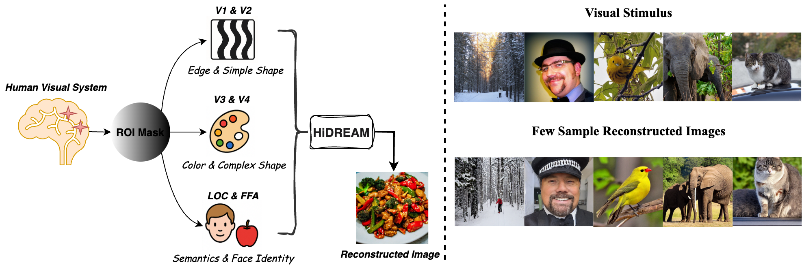
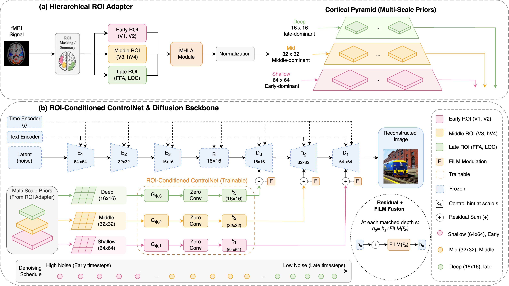

# Hi-DREAM: Brain-Inspired Hierarchical Diffusion for fMRI-to-Image Reconstruction via ROI Encoder and VisuAl Mapping




## News

- [**Jun 18, 2026**]: Our paper has been accepted to **ECCV 2026**! 🎉
- [**Jun 18, 2026**]: The **Hi-DREAM** project is now publicly available.


## Hi-Dream

**Hi-DREAM** is a research project for hierarchical fMRI-to-image reconstruction. The project explores how signals from different visual cortical regions can be mapped to different levels of a generative image model, enabling more structured and semantically meaningful image reconstruction from human brain activity.




## Project Structure

```text
Hi-Dream/
├── configs/                 # Example configuration files
├── scripts/                 # Training and inference entry points
├── src                      # Core package code
├── .gitignore
├── environment.yml
├── requirements.txt
└── README.md
```

## Result


## Installation

Clone the repository:

```bash
git clone https://github.com/Zhang-gw97/Hi-Dream.git
cd Hi-Dream
```

Create a conda environment:

```bash
conda env create -f environment.yml
conda activate hi-dream
```

Alternatively, install the Python dependencies with pip:

```bash
pip install -r requirements.txt
```

## Example Usage

The current scripts are lightweight placeholders for the final release. After the full implementation is added, the expected workflow will be:

```bash
python scripts/train.py --config configs/hidream_example.yaml
python scripts/inference.py --config configs/hidream_example.yaml --checkpoint path/to/checkpoint.pt
```

## Data

This project is designed for fMRI-based visual reconstruction experiments. Dataset preparation scripts and instructions will be added in a later release.

For public datasets such as NSD, users should follow the original dataset access requirements and licensing terms.

## Citation

If you find this project useful, please cite:

```bibtex
@inproceedings{zhang2026hi,
  title     = {Hi-DREAM: Brain-Inspired Hierarchical Diffusion for fMRI-to-Image Reconstruction via ROI Encoder and VisuAl Mapping},
  author    = {Zhang, Guowei and Zhao, Yun and Sun, Kai and Khajehnejad, Moein and Razi, Adeel and Phung, Dinh and Kuhlmann, Levin},
  booktitle = {European Conference on Computer Vision},
  year      = {2026}
}
```
